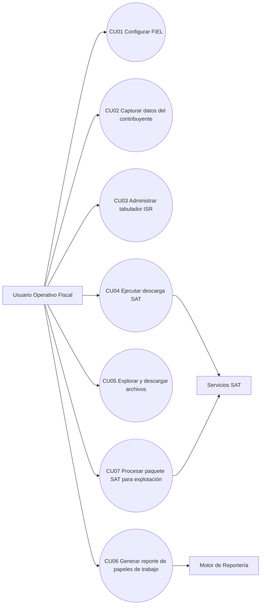

# F-AT-01 Análisis Técnico

## Información de Control

| Campo | Valor |
|---|---|
| Nivel del Requerimiento | N2 |
| Folio y Nombre del Requerimiento | SAT-WS-001 – Descarga Masiva SAT y Generación de Reportes |
| Nombre del Analista de Diseño | Equipo SAT WS |
| Unidad de Fábrica | Desarrollo Interno |
| Subdominio | Fiscal / SAT / Automatización |
| Fecha de Elaboración | 2026-03-05 |

## Control de Versiones del Documento

| Fecha | Versión | Autor | Descripción |
|---|---:|---|---|
| 2026-03-05 | 1.0 | Ing. Angel López | Creación inicial del Análisis Técnico para el sistema actual. |
| 2026-03-05 | 1.1 | Ing. Angel López | Se agregan casos de uso (CU) con flujo Usuario/Sistema por requerimiento funcional. |

## Índice

1. Identificador del Requerimiento  
2. Glosario  
3. Descripción General  
4. Alcance  
5. Diagrama de Casos de Uso  
5.1 Objetivos  
5.2 Lista de Actores  
6. Requerimientos Funcionales  
7. Requerimientos No Funcionales  
8. Reglas de Negocio  
9. Dependencias e Interfaces  
10. Riesgos y Mitigaciones  
11. Trazabilidad

---

## 1. Identificador del Requerimiento

| Campo | Valor |
|---|---|
| Nombre del Requerimiento | Descarga y explotación de comprobantes SAT |
| Folio del Requerimiento | SAT-WS-001 |
| Clasificación | Evolutivo / Productivo |
| Dirección de Área | Operación Fiscal / Cumplimiento |
| Programa | Automatización de descargas y papeles de trabajo |

## 2. Glosario

| Concepto | Definición |
|---|---|
| SAT | Servicio de Administración Tributaria de México. |
| CFDI | Comprobante Fiscal Digital por Internet. |
| FIEL / e.firma | Certificados usados para autenticación y firma de solicitudes SAT. |
| RFC | Registro Federal de Contribuyentes. |
| SSE | Server-Sent Events para progreso en tiempo real de descargas. |
| Tabulador ISR | Tabla de tramos y tasas para cálculo/soporte de reportes. |

## 3. Descripción General

El sistema permite:
- Configurar datos del contribuyente y certificados FIEL.
- Ejecutar descarga masiva de CFDI/retenciones contra servicios SAT.
- Consultar estado, paquetes y archivos descargados.
- Generar reportes de trabajo (salida XLSX) con bitácora.

Está implementado en FastAPI con interfaz web y módulos especializados en `app/sat` para autenticación, consulta, verificación y descarga.

## 4. Alcance

### 4.1 En alcance
- Configuración de FIEL y validación de certificados.
- Gestión de datos de contribuyente.
- Descarga de documentos SAT por periodos y tipos.
- Exploración/descarga de archivos generados.
- Generación de reportes y consulta de estatus.
- Trazabilidad vía logs en `storage/`.

### 4.2 Fuera de alcance
- Timbrado de CFDI.
- Presentación automática de declaraciones ante SAT.
- Integración contable ERP de terceros (no incluida en esta versión base).

## 5. Diagrama de Casos de Uso

### 5.1 Objetivos

| Nombre | Descripción | Actores |
|---|---|---|
| RF01-RFE01-CU01 – Configurar FIEL | Permite registrar y validar credenciales FIEL para habilitar operaciones con SAT. | Usuario Operativo Fiscal |
| RF02-RFE01-CU01 – Capturar datos del contribuyente | Permite registrar y consultar datos fiscales base del contribuyente. | Usuario Operativo Fiscal |
| RF03-RFE01-CU01 – Administrar tabulador ISR | Permite gestionar tabuladores ISR por ejercicio con validación de estructura. | Usuario Operativo Fiscal |
| RF04-RFE01-CU01 – Ejecutar descarga SAT | Permite consultar y descargar comprobantes fiscales por periodo con seguimiento de progreso. | Usuario Operativo Fiscal, Servicios SAT |
| RF05-RFE01-CU01 – Explorar y descargar archivos | Permite navegar y descargar archivos generados de manera segura. | Usuario Operativo Fiscal |
| RF06-RFE01-CU01 – Generar reporte de papeles de trabajo | Permite ejecutar la reportería fiscal y obtener salidas con evidencia operativa. | Usuario Operativo Fiscal, Motor de Reportería |
| RF07-RFE01-CU01 – Procesar paquete SAT para explotación | Permite leer paquetes SAT y exponer información estructurada para explotación posterior. | Usuario Operativo Fiscal, Servicios SAT |

### 5.2 Lista de Actores

| Actor | Tipo | Descripción |
|---|---|---|
| Usuario Operativo Fiscal | Humano | Configura parámetros y ejecuta descargas/reportes. |
| Servicios SAT | Sistema externo | Proveen autenticación, consulta, verificación y descarga. |
| Motor de Reportería | Sistema interno | Genera archivos de salida y logs de ejecución. |

## 6. Requerimientos Funcionales

### RF01 - Configuración FIEL

| Campo | Valor |
|---|---|
| ID. del Requerimiento Funcional | RF01 - Configuración FIEL |
| Breve Descripción | Permite registrar y validar credenciales FIEL mediante certificado `.cer`, llave `.key` y contraseña, para habilitar operaciones SAT y persistir la configuración en `config/fiel_config.json`. |

#### CU01 - Configurar FIEL

| Campo | Detalle |
|---|---|
| ID del Caso de Uso | RF01-RFE01-CU01 – Configurar FIEL |
| Actores | Usuario Operativo Fiscal |
| Pre-condiciones | 1) El usuario está en el módulo FIEL. 2) Cuenta con archivos `.cer` y `.key` válidos. 3) Tiene contraseña de llave privada. |
| Post-condiciones | 1) Configuración FIEL persistida exitosamente. 2) Estado FIEL disponible para operaciones SAT. |
| Puntos de Inclusión | N/A |
| Puntos de Extensión | CU04 - Ejecutar descarga SAT |

<table>
	<tr><th>Usuario Operativo Fiscal</th><th>Sistema</th></tr>
	<tr><td colspan="2"><strong>Flujo Principal</strong></td></tr>
	<tr><td>1. Ingresa a la sección de FIEL.</td><td>1. Muestra formulario para certificado, llave y contraseña.</td></tr>
	<tr><td>2. Selecciona archivo <code>.cer</code>, <code>.key</code> y captura contraseña.</td><td>2. Valida estructura de archivos y campos requeridos.</td></tr>
	<tr><td>3. Envía la configuración.</td><td>3. Valida certificados y consistencia de credenciales.</td></tr>
	<tr><td>4. Confirma guardado.</td><td>4. Persiste configuración en <code>config/fiel_config.json</code> y retorna estatus exitoso.</td></tr>
	<tr><td colspan="2">&nbsp;</td></tr>
	<tr><td colspan="2"><strong>Flujo Alterno - Credenciales inválidas</strong></td></tr>
	<tr><td>A1. Envía contraseña incorrecta o archivos no válidos.</td><td>A1. Muestra exactamente el mensaje: "No se recibio la contrasena" (si la contraseña está vacía) o el detalle de validación devuelto por backend en <code>message</code>; no persiste cambios.</td></tr>
</table>

##### Criterios de Aceptación
<table>
	<tr><th>Criterios de Aceptación</th></tr>
	<tr><td>• Se valida el formato y contenido de los archivos de certificado.</td></tr>
	<tr><td>• Solo se persiste configuración cuando la validación es exitosa.</td></tr>
	<tr><td>• Se muestra mensaje de error claro en caso de fallo.</td></tr>
</table>

##### Consideraciones / Observaciones
<table>
	<tr><th>Consideraciones / Observaciones</th></tr>
	<tr><td>• Requiere acceso de lectura a archivos locales de certificados.</td></tr>
	<tr><td>• El certificado debe corresponder con la llave privada y contraseña capturada.</td></tr>
</table>

### RF02 - Configuración Contribuyente

| Campo | Valor |
|---|---|
| ID. del Requerimiento Funcional | RF02 - Configuración Contribuyente |
| Breve Descripción | Permite guardar y consultar nombre, RFC y CURP del contribuyente, validando formato de RFC y dejando disponible el estado de configuración para los procesos posteriores. |

#### CU02 - Capturar datos del contribuyente

| Campo | Detalle |
|---|---|
| ID del Caso de Uso | RF02-RFE01-CU01 – Capturar datos del contribuyente |
| Actores | Usuario Operativo Fiscal |
| Pre-condiciones | 1) El usuario tiene acceso al módulo de contribuyente. 2) Cuenta con los datos fiscales a registrar. |
| Post-condiciones | 1) Datos de contribuyente guardados. 2) Información disponible para reportería y procesos relacionados. |
| Puntos de Inclusión | N/A |
| Puntos de Extensión | CU04 - Ejecutar descarga SAT; CU06 - Generar reporte de papeles de trabajo |

<table>
	<tr><th>Usuario Operativo Fiscal</th><th>Sistema</th></tr>
	<tr><td colspan="2"><strong>Flujo Principal</strong></td></tr>
	<tr><td>1. Abre módulo de contribuyente.</td><td>1. Carga datos existentes (si existen).</td></tr>
	<tr><td>2. Captura nombre, RFC y CURP.</td><td>2. Valida formato de RFC y estructura mínima de campos.</td></tr>
	<tr><td>3. Guarda información.</td><td>3. Persiste datos en <code>config/contribuyente_data.json</code> y confirma resultado.</td></tr>
	<tr><td colspan="2">&nbsp;</td></tr>
	<tr><td colspan="2"><strong>Flujo Alterno - RFC inválido</strong></td></tr>
	<tr><td>A1. Captura RFC con formato incorrecto.</td><td>A1. Muestra exactamente el mensaje: "El RFC debe tener el formato correcto: 3-4 letras, 6 digitos (AAMMDD), 3 caracteres finales".</td></tr>
</table>

##### Criterios de Aceptación
<table>
	<tr><th>Criterios de Aceptación</th></tr>
	<tr><td>• El RFC cumple la expresión de validación definida.</td></tr>
	<tr><td>• Los datos se recuperan correctamente en consultas posteriores.</td></tr>
</table>

##### Consideraciones / Observaciones
<table>
	<tr><th>Consideraciones / Observaciones</th></tr>
	<tr><td>• La CURP puede ser opcional según operación fiscal interna.</td></tr>
</table>

### RF03 - Gestión de Tabulador ISR

| Campo | Valor |
|---|---|
| ID. del Requerimiento Funcional | RF03 - Gestión de Tabulador ISR |
| Breve Descripción | Permite administrar el tabulador ISR por ejercicio fiscal, validando estructura de renglones y consultando periodos disponibles con su fecha de actualización. |

#### CU03 - Administrar tabulador ISR

| Campo | Detalle |
|---|---|
| ID del Caso de Uso | RF03-RFE01-CU01 – Administrar tabulador ISR |
| Actores | Usuario Operativo Fiscal |
| Pre-condiciones | 1) El usuario tiene acceso al módulo de tabulador. 2) Cuenta con ejercicio fiscal y renglones ISR válidos. |
| Post-condiciones | 1) Tabulador persistido para el ejercicio. 2) Periodo visible en catálogo de periodos disponibles. |
| Puntos de Inclusión | N/A |
| Puntos de Extensión | CU06 - Generar reporte de papeles de trabajo |

<table>
	<tr><th>Usuario Operativo Fiscal</th><th>Sistema</th></tr>
	<tr><td colspan="2"><strong>Flujo Principal</strong></td></tr>
	<tr><td>1. Selecciona ejercicio fiscal.</td><td>1. Consulta periodos disponibles y muestra tabulador vigente.</td></tr>
	<tr><td>2. Captura o pega renglones de tabulador ISR.</td><td>2. Normaliza y valida estructura de renglones.</td></tr>
	<tr><td>3. Guarda tabulador del ejercicio.</td><td>3. Persiste en <code>config/tabulador_isr.json</code> y actualiza fecha de modificación.</td></tr>
	<tr><td colspan="2">&nbsp;</td></tr>
	<tr><td colspan="2"><strong>Flujo Alterno - Ejercicio inválido</strong></td></tr>
	<tr><td>A1. Intenta guardar sin ejercicio de 4 dígitos.</td><td>A1. Muestra exactamente el mensaje: "Debes indicar un ejercicio valido de 4 digitos para guardar el tabulador ISR.".</td></tr>
</table>

##### Criterios de Aceptación
<table>
	<tr><th>Criterios de Aceptación</th></tr>
	<tr><td>• Se permite guardar solo con estructura de renglones válida.</td></tr>
	<tr><td>• El periodo queda disponible en el catálogo de ejercicios.</td></tr>
</table>

##### Consideraciones / Observaciones
<table>
	<tr><th>Consideraciones / Observaciones</th></tr>
	<tr><td>• Se recomienda mantener al menos un tabulador vigente por ejercicio operativo.</td></tr>
</table>

### RF04 - Descarga SAT

| Campo | Valor |
|---|---|
| ID. del Requerimiento Funcional | RF04 - Descarga SAT |
| Breve Descripción | Permite ejecutar el flujo autenticación → consulta → verificación → descarga contra SAT, soportando año/mes/rango personalizado, con progreso en tiempo real (SSE), manejo de reintentos y control de excepciones operativas. |

#### CU04 - Ejecutar descarga SAT

| Campo | Detalle |
|---|---|
| ID del Caso de Uso | RF04-RFE01-CU01 – Ejecutar descarga SAT |
| Actores | Usuario Operativo Fiscal, Servicios SAT |
| Pre-condiciones | 1) Configuración FIEL válida. 2) Parámetros de periodo/tipo capturados. 3) Conectividad disponible hacia servicios SAT. |
| Post-condiciones | 1) Archivos descargados en `descargas/` cuando hay resultados. 2) Bitácora de ejecución registrada. |
| Puntos de Inclusión | CU01 - Configurar FIEL |
| Puntos de Extensión | CU05 - Explorar y descargar archivos; CU06 - Generar reporte de papeles de trabajo |

<table>
	<tr><th>Usuario Operativo Fiscal</th><th>Sistema</th></tr>
	<tr><td colspan="2"><strong>Flujo Principal</strong></td></tr>
	<tr><td>1. Define tipo de descarga, periodo y tipos de documento.</td><td>1. Valida parámetros y prepara flujo de ejecución.</td></tr>
	<tr><td>2. Captura contraseña FIEL y lanza proceso.</td><td>2. Autentica con SAT, consulta, verifica y descarga paquetes.</td></tr>
	<tr><td>3. Monitorea avance.</td><td>3. Emite eventos SSE de progreso, reintento y resultado final.</td></tr>
	<tr><td>4. Revisa resultado de ejecución.</td><td>4. Registra bitácora en <code>storage/download-logs</code> y deja archivos en <code>descargas/</code>.</td></tr>
	<tr><td colspan="2">&nbsp;</td></tr>
	<tr><td colspan="2"><strong>Flujo Alterno - Sin resultados en periodo</strong></td></tr>
	<tr><td>A1. Ejecuta consulta para periodo sin comprobantes.</td><td>A1. Muestra exactamente un mensaje con este formato: "{TIPO_DOCUMENTO}: sin informacion en el periodo (CodigoEstadoSolicitud=5004).".</td></tr>
</table>

##### Criterios de Aceptación
<table>
	<tr><th>Criterios de Aceptación</th></tr>
	<tr><td>• El progreso se visualiza en tiempo real durante la ejecución.</td></tr>
	<tr><td>• Al finalizar, existe trazabilidad en log con estado de la operación.</td></tr>
	<tr><td>• Los archivos descargados quedan en la ruta esperada por tipo de documento.</td></tr>
</table>

##### Consideraciones / Observaciones
<table>
	<tr><th>Consideraciones / Observaciones</th></tr>
	<tr><td>• El tiempo de ejecución depende del volumen y respuesta de SAT.</td></tr>
	<tr><td>• El modo turbo puede generar múltiples solicitudes en paralelo.</td></tr>
</table>

### RF05 - Exploración y descarga de archivos

| Campo | Valor |
|---|---|
| ID. del Requerimiento Funcional | RF05 - Exploración y descarga de archivos |
| Breve Descripción | Permite navegar carpetas en `descargas/` y `reportes/`, descargar archivos por endpoint seguro y abrir su ubicación local desde el explorador del sistema. |

#### CU05 - Explorar y descargar archivos

| Campo | Detalle |
|---|---|
| ID del Caso de Uso | RF05-RFE01-CU01 – Explorar y descargar archivos |
| Actores | Usuario Operativo Fiscal |
| Pre-condiciones | 1) Existen archivos en `descargas/` o `reportes/`. 2) El usuario tiene acceso al módulo de exploración. |
| Post-condiciones | 1) Archivo descargado o ubicación abierta correctamente. 2) Navegación confinada a directorios autorizados. |
| Puntos de Inclusión | N/A |
| Puntos de Extensión | N/A |

<table>
	<tr><th>Usuario Operativo Fiscal</th><th>Sistema</th></tr>
	<tr><td colspan="2"><strong>Flujo Principal</strong></td></tr>
	<tr><td>1. Abre explorador de descargas/reportes.</td><td>1. Lista carpetas y archivos disponibles con metadatos.</td></tr>
	<tr><td>2. Navega a una carpeta específica.</td><td>2. Valida ruta permitida y muestra contenido.</td></tr>
	<tr><td>3. Solicita descarga de un archivo.</td><td>3. Entrega archivo solicitado con validaciones de seguridad de ruta.</td></tr>
	<tr><td>4. Solicita abrir ubicación local.</td><td>4. Invoca explorador del sistema en la carpeta correspondiente.</td></tr>
	<tr><td colspan="2">&nbsp;</td></tr>
	<tr><td colspan="2"><strong>Flujo Alterno - Ruta o archivo no permitido</strong></td></tr>
	<tr><td>A1. Solicita ruta inválida o archivo fuera del directorio permitido.</td><td>A1. Muestra exactamente uno de estos mensajes según el caso: "Parametro invalido.", "Directorio no encontrado." o "Archivo no encontrado.".</td></tr>
</table>

##### Criterios de Aceptación
<table>
	<tr><th>Criterios de Aceptación</th></tr>
	<tr><td>• Solo se permiten rutas dentro de directorios autorizados.</td></tr>
	<tr><td>• Se puede descargar archivo existente de forma íntegra.</td></tr>
</table>

##### Consideraciones / Observaciones
<table>
	<tr><th>Consideraciones / Observaciones</th></tr>
	<tr><td>• El comportamiento de "abrir ubicación" depende del sistema operativo.</td></tr>
</table>

### RF06 - Generación de reportes

| Campo | Valor |
|---|---|
| ID. del Requerimiento Funcional | RF06 - Generación de reportes |
| Breve Descripción | Permite ejecutar el proceso de reportería vía subprocess, devolviendo estado de ejecución, rutas de salida y log, además de consultar disponibilidad de reportes generados. |

#### CU06 - Generar reporte de papeles de trabajo

| Campo | Detalle |
|---|---|
| ID del Caso de Uso | RF06-RFE01-CU01 – Generar reporte de papeles de trabajo |
| Actores | Usuario Operativo Fiscal, Motor de Reportería |
| Pre-condiciones | 1) Datos de contribuyente capturados. 2) Tabulador ISR disponible para el periodo. 3) Configuración de reportería válida. |
| Post-condiciones | 1) Archivo XLSX generado en `reportes/` cuando aplica. 2) Log de ejecución disponible. |
| Puntos de Inclusión | CU02 - Capturar datos del contribuyente; CU03 - Administrar tabulador ISR |
| Puntos de Extensión | CU05 - Explorar y descargar archivos |

<table>
	<tr><th>Usuario Operativo Fiscal</th><th>Sistema</th></tr>
	<tr><td colspan="2"><strong>Flujo Principal</strong></td></tr>
	<tr><td>1. Selecciona periodo y parámetros de reporte.</td><td>1. Verifica prerequisitos (contribuyente/tabulador/configuración).</td></tr>
	<tr><td>2. Ejecuta generación de reporte.</td><td>2. Invoca proceso de reportería y monitorea salida.</td></tr>
	<tr><td>3. Consulta estatus de generación.</td><td>3. Devuelve estatus, ruta del archivo y log asociado.</td></tr>
	<tr><td>4. Descarga reporte generado.</td><td>4. Expone archivo XLSX desde <code>reportes/</code> mediante endpoint seguro.</td></tr>
	<tr><td colspan="2">&nbsp;</td></tr>
	<tr><td colspan="2"><strong>Flujo Alterno - Prerrequisitos incompletos</strong></td></tr>
	<tr><td>A1. Ejecuta generación sin datos de contribuyente o tabulador válido.</td><td>A1. Muestra exactamente uno de estos mensajes según el faltante: "Primero guarda tus datos fiscales en \"Datos del Contribuyente\"." o "No se encontro un tabulador ISR guardado para el ejercicio {periodo}.".</td></tr>
</table>

##### Criterios de Aceptación
<table>
	<tr><th>Criterios de Aceptación</th></tr>
	<tr><td>• El proceso genera archivo XLSX cuando hay datos suficientes.</td></tr>
	<tr><td>• Se registra log de ejecución para auditoría y soporte.</td></tr>
</table>

##### Consideraciones / Observaciones
<table>
	<tr><th>Consideraciones / Observaciones</th></tr>
	<tr><td>• El tiempo y consumo dependen del volumen de archivos en <code>descargas/</code>.</td></tr>
</table>

### RF07 - Lectura de paquetes SAT

| Campo | Valor |
|---|---|
| ID. del Requerimiento Funcional | RF07 - Lectura de paquetes SAT |
| Breve Descripción | Permite procesar paquetes ZIP de CFDI/metadata y exponer iteradores/objetos de dominio para su consumo interno y explotación posterior. |

#### CU07 - Procesar paquete SAT para explotación

| Campo | Detalle |
|---|---|
| ID del Caso de Uso | RF07-RFE01-CU01 – Procesar paquete SAT para explotación |
| Actores | Usuario Operativo Fiscal, Servicios SAT |
| Pre-condiciones | 1) Paquete ZIP disponible y accesible. 2) Estructura de archivos compatible con lector de paquetes. |
| Post-condiciones | 1) Registros procesados y listos para explotación interna. 2) Errores de lectura reportados de forma controlada. |
| Puntos de Inclusión | N/A |
| Puntos de Extensión | N/A |

<table>
	<tr><th>Usuario / Proceso consumidor</th><th>Sistema</th></tr>
	<tr><td colspan="2"><strong>Flujo Principal</strong></td></tr>
	<tr><td>1. Proporciona paquete ZIP SAT para lectura.</td><td>1. Abre paquete y aplica filtros por tipo de contenido (CFDI/metadata).</td></tr>
	<tr><td>2. Solicita iteración de registros.</td><td>2. Devuelve iteradores/objetos de dominio para consumo interno.</td></tr>
	<tr><td>3. Solicita UUID/contenido para integración posterior.</td><td>3. Entrega datos estructurados y controla errores de lectura/formato.</td></tr>
	<tr><td colspan="2">&nbsp;</td></tr>
	<tr><td colspan="2"><strong>Flujo Alterno - Paquete inválido o corrupto</strong></td></tr>
	<tr><td>A1. Intenta procesar un ZIP corrupto o no compatible.</td><td>A1. Muestra exactamente un mensaje de error de lectura del paquete, por ejemplo: "Unable to open Zip file {filename}".</td></tr>
</table>

##### Criterios de Aceptación
<table>
	<tr><th>Criterios de Aceptación</th></tr>
	<tr><td>• Se procesan correctamente paquetes compatibles.</td></tr>
	<tr><td>• Los errores de lectura se reportan con diagnóstico entendible.</td></tr>
</table>

##### Consideraciones / Observaciones
<table>
	<tr><th>Consideraciones / Observaciones</th></tr>
	<tr><td>• Es recomendable conservar el paquete original para trazabilidad ante incidencias.</td></tr>
</table>

## 7. Requerimientos No Funcionales

| ID | Requerimiento |
|---|---|
| RNF01 | API con tiempos de respuesta aceptables para operaciones de consulta y configuración. |
| RNF02 | Registro de eventos y errores en bitácoras operativas (`storage/download-logs`, `storage/reporting-logs`). |
| RNF03 | Validación de entradas para evitar traversal e inyección en rutas/archivos. |
| RNF04 | Compatibilidad con Python 3.10+ y ejecución local sobre Windows. |
| RNF05 | Mantenibilidad modular (`app/routes`, `app/sat`, `reporting`). |
| RNF06 | Configuración externa vía archivos JSON y variables de entorno cuando aplique. |

## 8. Reglas de Negocio

- Solo se procesa descarga SAT cuando existe configuración FIEL válida.
- El tabulador ISR para guardar debe incluir ejercicio válido de 4 dígitos.
- Los archivos solicitados para descarga deben residir dentro de directorios permitidos.
- La generación de reportes requiere datos de contribuyente capturados.

## 9. Dependencias e Interfaces

### 9.1 Dependencias de software
- FastAPI, Uvicorn
- cryptography, httpx, lxml
- openpyxl, pandas, pypdf (proceso de reportes)

### 9.2 Interfaces principales (REST)
- `/api/fiel/*`
- `/api/contribuyente/*`
- `/api/tabulador/*`
- `/api/sat/*`
- `/api/downloads/*`
- `/api/reports/*`
- `/api/packages/*`

## 10. Riesgos y Mitigaciones

| Riesgo | Impacto | Mitigación |
|---|---|---|
| Cambios en servicios SAT | Alto | Encapsular lógica SAT en traductores y validadores; monitoreo de errores. |
| Errores en certificados FIEL | Alto | Validación previa y mensajes claros de diagnóstico. |
| Tiempo elevado en consultas masivas | Medio | Modo turbo, reintentos y troceo de periodos. |
| Crecimiento de archivos/logs | Medio | Política de limpieza y rotación operativa. |

## 11. Trazabilidad

| Requerimiento | Módulo / Ruta |
|---|---|
| RF01 | `app/routes/fiel.py`, `app/config/fiel_config.py` |
| RF02 | `app/routes/contribuyente.py`, `app/config/contribuyente_config.py` |
| RF03 | `app/routes/tabulador.py`, `app/config/tabulador_config.py` |
| RF04 | `app/routes/sat.py`, `app/sat/service.py`, `app/sat/services/*` |
| RF05 | `app/routes/downloads.py` |
| RF06 | `app/routes/reports.py`, `reporting/*` |
| RF07 | `app/routes/packages.py`, `app/sat/package_reader/*` |
