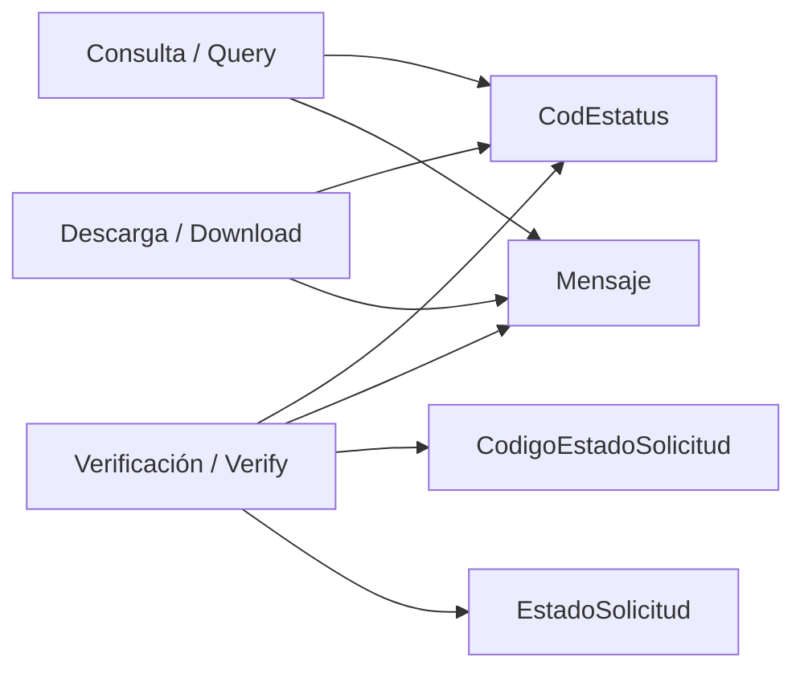
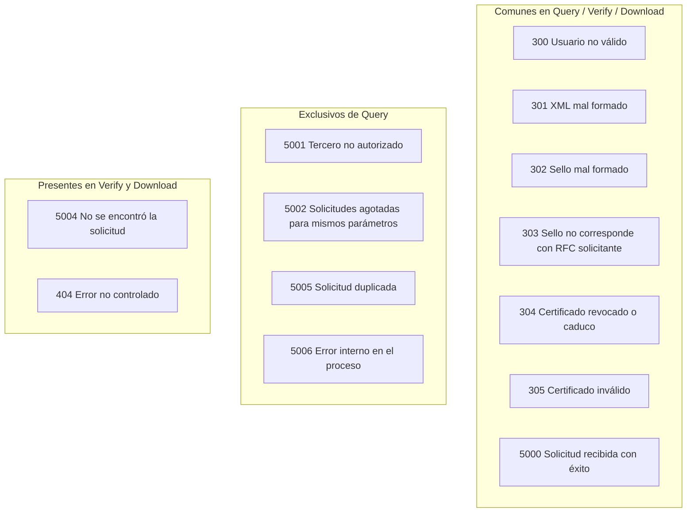
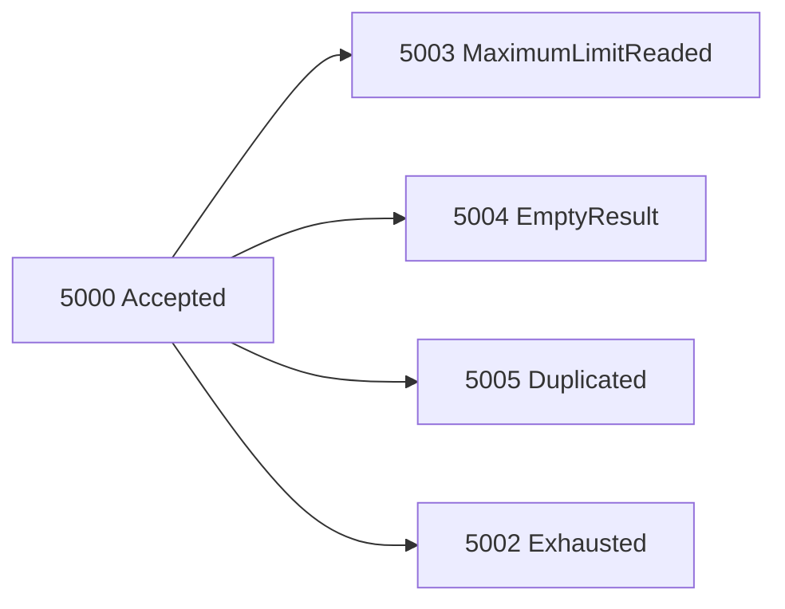
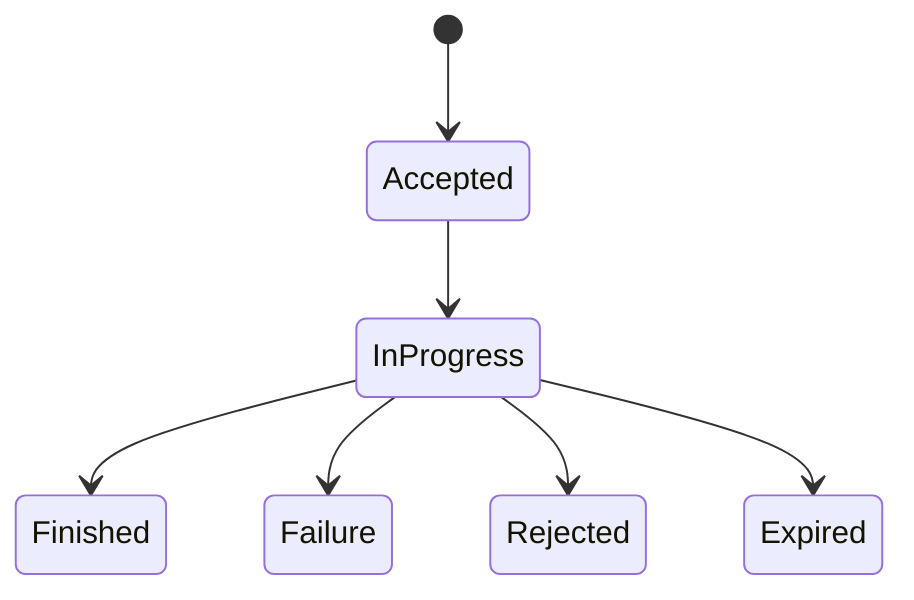

# Códigos de servicios

Los servicios `Consulta/Query`, `Verificación/Verify` y `Descarga/Download` regresan códigos para entender el estado de la operación.

## Vista general

## `CodEstatus` (StatusCode)

`CodEstatus` y `Mensaje` están presentes en los tres servicios. En código se exponen vía `StatusCode` (`getCode()` y `getMessage()`).

| Servicio | Code | Descripción |
|---|---:|---|
| All | 300 | Usuario no válido |
| All | 301 | XML mal formado |
| All | 302 | Sello mal formado |
| All | 303 | Sello no corresponde con RfcSolicitante |
| All | 304 | Certificado revocado o caduco |
| All | 305 | Certificado inválido |
| All | 5000 | Solicitud recibida con éxito |
| Query | 5001 | Tercero no autorizado |
| Query | 5002 | Se agotó las solicitudes de por vida: Máximo para solicitudes con los mismos parámetros |
| Verify & Download | 5004 | No se encontró la solicitud |
| Query | 5005 | Solicitud duplicada: Si existe una solicitud vigente con los mismos parámetros |
| Query | 5006 | Error interno en el proceso |
| Verify & Download | 404 | Error no controlado: Reintentar más tarde la petición |

> Nota: Aunque `404` no siempre está documentado en todos los flujos, se observa en operación real.

## `CodigoEstadoSolicitud` (CodeRequest)

Aparece en `Verify`. Representa el estado de la solicitud de descarga.

| Code | Name | Descripción |
|---:|---|---|
| 5000 | Accepted | Solicitud recibida con éxito |
| 5002 | Exhausted | Se agotó las solicitudes de por vida: Máximo para solicitudes con los mismos parámetros |
| 5003 | MaximumLimitReaded | Tope máximo: Se está superando el tope máximo de CFDI o Metadata |
| 5004 | EmptyResult | No se encontró la solicitud |
| 5005 | Duplicated | Solicitud duplicada: Si existe una solicitud vigente con los mismos parámetros |

## `EstadoSolicitud` (StatusRequest)

También aparece en `Verify` y modela el ciclo de vida de la solicitud.

| Code | Name | Descripción |
|---:|---|---|
| 1 | Accepted | Aceptada |
| 2 | InProgress | En proceso |
| 3 | Finished | Terminada |
| 4 | Failure | Error |
| 5 | Rejected | Rechazada |
| 6 | Expired | Vencida |

