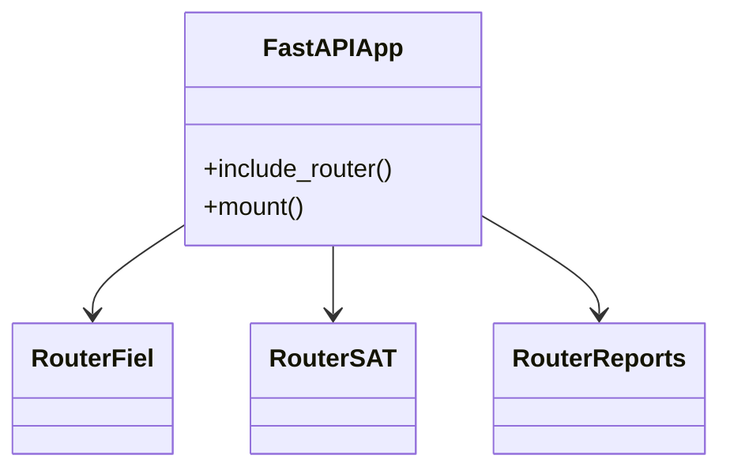
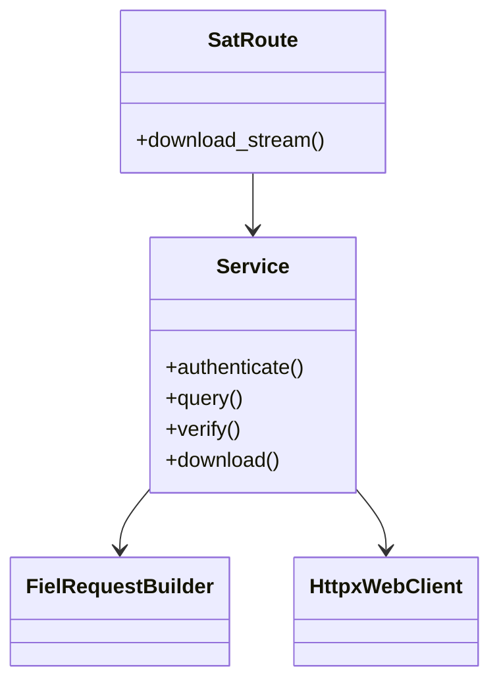
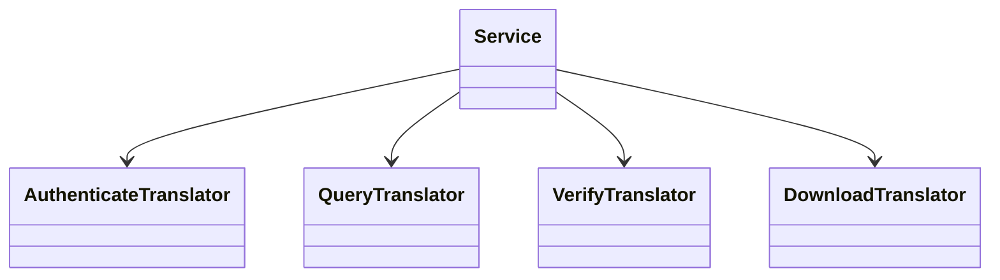
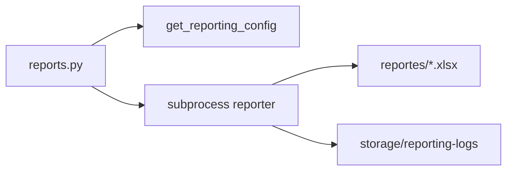
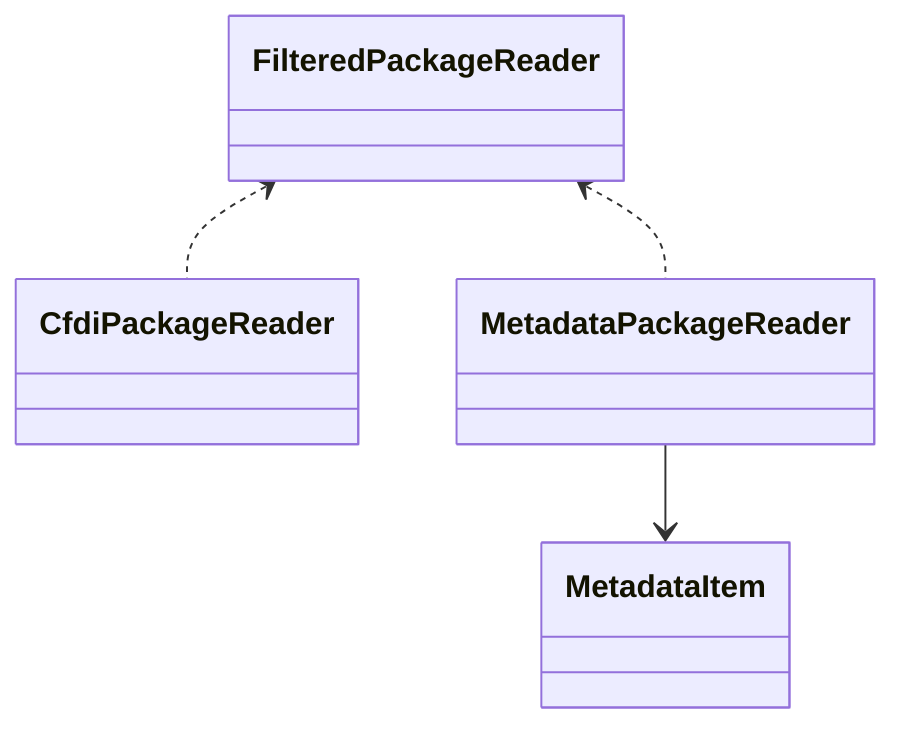

# F-DI-06 Diseño Detallado

## Información de Control

| Campo | Valor |
|---|---|
| Nivel del Requerimiento | N2 |
| Folio y Nombre del Requerimiento | SAT-WS-001 – Descarga Masiva SAT y Generación de Reportes |
| Nombre del Analista de Diseño | Equipo SAT WS |
| Unidad de Fábrica | Desarrollo Interno |
| Subdominio | Fiscal / SAT / Automatización |
| Fecha de Elaboración | 2026-03-05 |

## Control de Versiones del Documento

| Fecha | Versión | Autor | Descripción |
|---|---:|---|---|
| 2026-03-05 | 1.0 | GitHub Copilot + Equipo SAT WS | Creación inicial del Diseño Detallado del sistema actual. |

## Índice

1. Componentes Reutilizados y/o Compartidos  
1.1. Componente `app/main.py`  
1.2. Componente `app/routes/sat.py`  
1.3. Componente `app/sat/service.py`  
1.4. Componente `app/routes/reports.py`  
1.5. Componente `app/sat/package_reader/*`  
2. Modelo de Datos y Configuración  
3. Manejo de Errores y Estados Especiales  
4. Seguridad y Validaciones  
5. Consideraciones de Despliegue

---

## 1. Componentes Reutilizados y/o Compartidos

### 1.1. Componente `app/main.py`

#### 1.1.1. Descripción del Componente
Punto de entrada FastAPI. Registra rutas, expone la UI principal, monta estáticos y define metadatos de API.

#### 1.1.2. Parámetros e Interfaces del Componente
- HTTP `GET /` para dashboard principal.
- Registro de routers:
  - `/api/fiel`
  - `/api/contribuyente`
  - `/api/downloads`
  - `/api/sat`
  - `/api/reports`
  - `/api/tabulador`
  - `/api/packages`

#### 1.1.2.1. Mapeo de Campos
| Entrada | Destino |
|---|---|
| Request HTTP | Router correspondiente |
| Assets estáticos | `/assets` |
| Plantilla principal | `templates/index.html` |

#### 1.1.3. Diagrama de Clases

#### 1.1.4. Manejo de Errores
- Errores de endpoint propagados por cada router.
- Respuestas JSON con `status_code` apropiado en rutas de API.

#### 1.1.5. Manejo de Estados Especiales
- Si no existe `assets/`, la app sigue operando sin montar estáticos.
- Si falla lectura de template principal, retorna error de servidor.

---

### 1.2. Componente `app/routes/sat.py`

#### 1.2.1. Descripción del Componente
Orquesta la descarga masiva SAT con progreso en tiempo real (SSE), partición de periodos, reintentos y extracción de paquetes.

#### 1.2.2. Parámetros e Interfaces del Componente
- Endpoint principal: `POST /api/sat/download/stream`
- Entradas relevantes: tipo de descarga, rango de fechas, tipo de documento, estatus, password FIEL, flags de turbo y filtrado.
- Salida: stream SSE con eventos `progress`, `retry`, `complete`, `error`.

#### 1.2.2.1. Mapeo de Campos
| Campo de entrada | Uso interno |
|---|---|
| `fiel_password` | Construcción de `Fiel` y `FielRequestBuilder` |
| `fecha_inicio/fecha_fin` | `DateTimePeriod` / chunking |
| `doc_nomina/doc_retenciones/doc_ingresos` | `DocumentType` + reglas de carpeta |
| `document_status` | `DocumentStatus` |
| `turbo_mode` | Selección de flujo normal/turbo |

#### 1.2.3. Diagrama de Clases

#### 1.2.4. Manejo de Errores
- Reintentos automáticos para códigos de saturación/duplicidad.
- Cierre con evento SSE de error cuando no es recuperable.
- Registro en bitácora de descarga para diagnóstico.

#### 1.2.5. Manejo de Estados Especiales
- Sin datos en periodo: flujo termina sin fallo catastrófico.
- Rangos grandes: segmentación automática en bloques.
- Modo turbo: cola de solicitudes y polling round-robin.

---

### 1.3. Componente `app/sat/service.py`

#### 1.3.1. Descripción del Componente
Fachada de dominio para operaciones SAT (`authenticate`, `query`, `verify`, `download`) aislando detalles SOAP y cliente HTTP.

#### 1.3.2. Parámetros e Interfaces del Componente
- Entradas:
  - `RequestBuilderInterface`
  - `WebClientInterface`
  - `ServiceEndpoints`
- Operaciones async:
  - `authenticate()`
  - `query(QueryParameters)`
  - `verify(request_id)`
  - `download(package_id)`

#### 1.3.2.1. Mapeo de Campos
| Método | Traductor |
|---|---|
| `authenticate` | `AuthenticateTranslator` |
| `query` | `QueryTranslator` |
| `verify` | `VerifyTranslator` |
| `download` | `DownloadTranslator` |

#### 1.3.3. Diagrama de Clases

#### 1.3.4. Manejo de Errores
- Excepciones de transporte y SOAP encapsuladas por `WebClientException`.
- Respuestas inválidas detectadas por traductores/validadores.

#### 1.3.5. Manejo de Estados Especiales
- Token se administra de forma interna para llamadas subsecuentes.
- Endpoints CFDI/Retenciones seleccionables según contexto.

---

### 1.4. Componente `app/routes/reports.py`

#### 1.4.1. Descripción del Componente
Gestiona estatus, generación y exploración de reportes de salida.

#### 1.4.2. Parámetros e Interfaces del Componente
- `GET /api/reports/status`
- `POST /api/reports/generate`
- `GET /api/reports/browse`

#### 1.4.2.1. Mapeo de Campos
| Entrada | Uso |
|---|---|
| `periodo` | Parámetro del script de reportería |
| `tabulador_isr` | Archivo temporal de tabulador normalizado |
| Config reporting | `python_path`, `script_path`, `output_dir`, `logs_dir` |

#### 1.4.3. Diagrama de Clases

#### 1.4.4. Manejo de Errores
- Validaciones previas de configuraciones y archivos.
- Timeout de proceso externo controlado.
- Conversión de error a respuesta JSON útil para UI.

#### 1.4.5. Manejo de Estados Especiales
- Si no hay reporte, `status` devuelve bandera `has_report=false`.
- Si no hay tabulador del periodo, se devuelve error de negocio.

---

### 1.5. Componente `app/sat/package_reader/*`

#### 1.5.1. Descripción del Componente
Lectura de paquetes ZIP SAT para CFDI y metadata, con filtros por tipo de archivo y utilidades de parsing.

#### 1.5.2. Parámetros e Interfaces del Componente
- `CfdiPackageReader`
- `MetadataPackageReader`
- `FilteredPackageReader`
- `CsvReader` y preprocessors

#### 1.5.2.1. Mapeo de Campos
| Archivo en ZIP | Procesamiento |
|---|---|
| XML CFDI | UUID + contenido completo |
| TXT metadata | Conversión a `MetadataItem` |
| TXT terceros | Enriquecimiento de registros |

#### 1.5.3. Diagrama de Clases

#### 1.5.4. Manejo de Errores
- Excepciones específicas al abrir ZIP o crear temporal.
- Ignora entradas no válidas fuera de filtros definidos.

#### 1.5.5. Manejo de Estados Especiales
- Lectura desde archivo o bytes.
- Limpieza de temporales en ciclo de vida del reader.

---

## 2. Modelo de Datos y Configuración

### 2.1 Archivos de configuración
- `config/fiel_config.json`
- `config/contribuyente_data.json`
- `config/tabulador_isr.json`

### 2.2 Directorios operativos
- `descargas/` (resultado SAT)
- `reportes/` (salidas de papel de trabajo)
- `storage/download-logs/`
- `storage/reporting-logs/`
- `storage/tabuladores/`

## 3. Manejo de Errores y Estados Especiales

- Respuestas API uniformes con `success`/`message` cuando aplica.
- Captura de excepciones por capa (routes, service, web_client).
- Estrategias de reintento para escenarios transitorios.
- Registro de eventos para auditoría operativa.

## 4. Seguridad y Validaciones

- Sanitización de rutas en endpoints de archivos.
- Restricción de directorios base para descargas.
- Validación de RFC y periodos antes de persistencia.
- Certificados FIEL validados antes de invocar servicios SAT.

## 5. Consideraciones de Despliegue

- Ejecución local recomendada:
  - `uvicorn app.main:app --reload --host 127.0.0.1 --port 8000`
- Dependencias en `requirements.txt`.
- Recomendado venv dedicado por proyecto.
- Monitoreo periódico de tamaño de `descargas/`, `reportes/` y `storage/*`.
